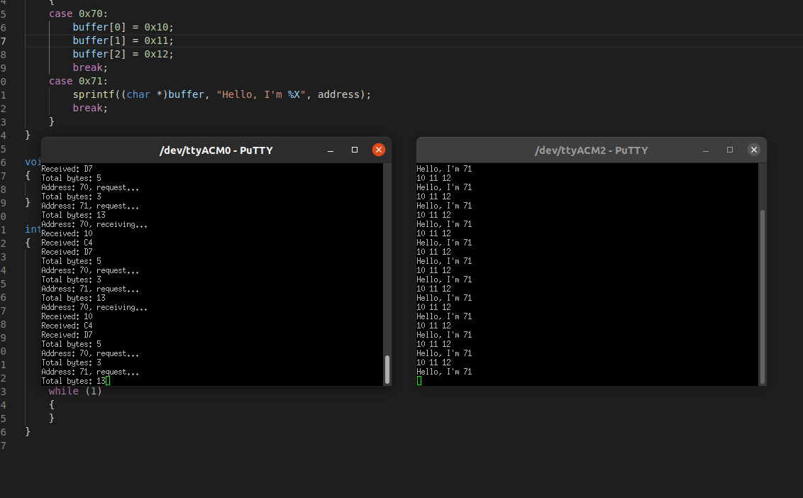

## I2C slave protocol to answer to multiple addresses for the RP2040

This is a pio program for the RP2040 that implements I2C slave protocol and answers to multiple addresses. It is compatible with the [SDK](https://raspberrypi.github.io/pico-sdk-doxygen/) and [Arduino](https://github.com/earlephilhower/arduino-pico).

How to use it:

- With SDK. Add *i2c_slave_multi.pio, i2c_slave_multi_pio.h and i2c_slave_multi_pio.c* to your project. Modify CMakeLists.txt. Add *pico_generate_pio_header* and the required libraries (pico_stdlib, hardware_irq, hardware_pio, hardware_i2c). See [CMakeLists.txt](sdk/CMakeLists.txt).
- With Arduino. Add *i2c_slave_multi.pio.h, i2c_slave_multi_pio.h and i2c_slave_multi_pio.c* to your project.
- Define required handlers: receive, request and stop. Handlers are optional.
- Set pointer to write buffer.
- Enable desired I2C addresses to send and receive data.

Use pull up resistors (1k to 3.3k)

See [main.c](sdk/main.c) with code example. 

Occupies one entire pio.

   
  <i>RP2040 as I2C slave (left), receving and sending data to multiple I2C addresses sent from I2C master (right)</i>  

Functions:  
\
**void i2c_multi_init(pio, pin)**  

Must be called in first place

Parameters:  
&nbsp;&nbsp;**pio** - load the pio program at pio0 or pio1  
&nbsp;&nbsp;**pin** - set SDA at pin and SCL at pin + 1  
\
**void i2c_multi_set_receive_handler(i2c_receive_handler_t i2c_receive_handler)**  

Parameters:  
&nbsp;&nbsp;**i2c_receive_handler** - receive handler function  
\
**void i2c_multi_set_request_handler(i2c_request_handler_t i2c_request_handler)**  

Parameters:  
&nbsp;&nbsp;**i2c_request_handler** - request handler function  
\
**void i2c_multi_set_stop_handler(i2c_stop_handler_t 2c_stop_handler)**  

Parameters:  
&nbsp;&nbsp;**i2c_stop_handler** - stop handler function  
\
**void i2c_multi_set_write_buffer(uint8_t buffer)**  

Parameters:  
&nbsp;&nbsp;**buffer** - write buffer  
\
**void i2c_multi_disable()**  

Sets I2C on hold. Disables I2C pio states machines  
\
**void i2c_multi_restart()**  

Restart I2C pio states machines and the byte counter  
\
**void i2c_multi_remove()**  

Removes I2C pio states machines, handlers, write buffer and counter  
\
**void i2c_multi_enable_address(uint8_t address)**  

Parameters:  
&nbsp;&nbsp;**address** - enable I2C address  
\
**void i2c_multi_disable_address(uint8_t address)**  

Parameters:  
&nbsp;&nbsp;**address** - disable I2C address  
\
**void i2c_multi_enable_all_addresses()**  
Enables all I2C addresses  
\
**void i2c_multi_disable_all_addresses()**  
Disables all I2C addresses  
\
**bool i2c_multi_is_address_enabled(uint8_t address)**  

Parameters:  
&nbsp;&nbsp;**address** - check wheter I2C address is enabled  

Returns:  
&nbsp;&nbsp;true if enabled, false if disabled  
\
Handler functions:  
\
**void receive_handler(uint8_t data, bool is_address)**  

Parameters received:  
&nbsp;&nbsp;**data** - byte or address received   
&nbsp;&nbsp;**is_address** - true is address, false is byte received  
\
**void request_handler(uint8_t address)**  

Parameters received:  
&nbsp;&nbsp;**address** - I2C address   
\
**void stop_handler(uint8_t length)**  

Parameters received:  
&nbsp;&nbsp;**length** - number of bytes received or sent   
