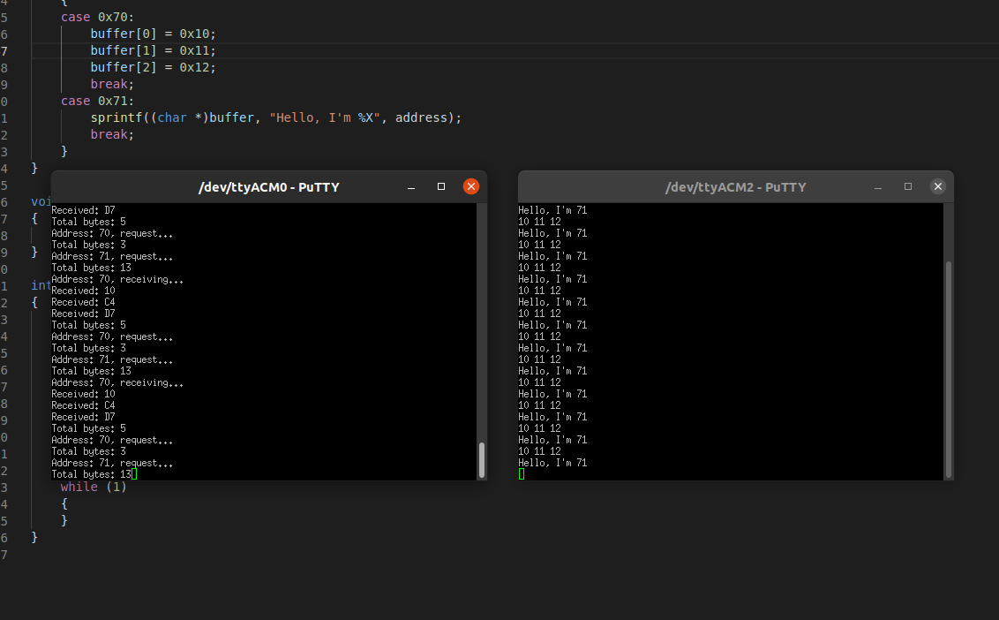

# I2C slave protocol for multiple addresses on RP2040

This library implements an I2C slave protocol for the RP2040 using PIO, with support for responding to multiple I2C addresses.

It is compatible with both the [Pico SDK](https://raspberrypi.github.io/pico-sdk-doxygen/) and [Arduino-Pico](https://github.com/earlephilhower/arduino-pico).

## Features

- I2C slave implemented in PIO
- Supports multiple I2C addresses
- Compatible with Pico SDK and Arduino
- Optional receive, request, and stop handlers
- Supports fixed-length transfers for compatibility with buggy I2C masters
- Up to 2 MHz in v1.1
- Uses one full PIO instance

## Usage

### Pico SDK

Add the following files to your project:

- `i2c_multi.pio`
- `i2c_multi.h`
- `i2c_multi.c`

Then update your `CMakeLists.txt` to:

- call `pico_generate_pio_header`
- link the required libraries:
  - `pico_stdlib`
  - `hardware_irq`
  - `hardware_pio`
  - `hardware_i2c`

See [sdk/CMakeLists.txt](sdk/CMakeLists.txt) for an example.

### Arduino

Add the following files to your project:

- `i2c_multi.pio.h`
- `i2c_multi.h`
- `i2c_multi.c`

### Basic setup

- Define the receive, request, and stop handlers if needed
- Set the write buffer pointer
- Enable the I2C addresses you want to use for communication

## Hardware notes

**Use pull-up resistors from 1 kΩ to 3.3 kΩ.**  
Use lower resistor values for higher bus speeds.

See [sdk/main.c](sdk/main.c) for a usage example.

   
  <i>RP2040 configured as an I2C slave (left), receiving and sending data through multiple I2C addresses from an I2C master (right)</i>

## API reference

### `void i2c_multi_init(pio, pin)`

Must be called first.

**Parameters**
- `pio` - PIO instance where the program will be loaded (`pio0` or `pio1`)
- `pin` - SDA pin number; SCL is assigned to `pin + 1`

---

### `void i2c_multi_set_receive_handler(i2c_receive_handler_t i2c_receive_handler)`

Sets the receive handler.

**Parameters**
- `i2c_receive_handler` - function called when data or an address is received

---

### `void i2c_multi_set_request_handler(i2c_request_handler_t i2c_request_handler)`

Sets the request handler.

**Parameters**
- `i2c_request_handler` - function called when the master requests data

---

### `void i2c_multi_set_stop_handler(i2c_stop_handler_t i2c_stop_handler)`

Sets the stop handler.

**Parameters**
- `i2c_stop_handler` - function called when a STOP condition is detected

---

### `void i2c_multi_set_write_buffer(uint8_t \*buffer)`

Sets the write buffer.

**Parameters**
- `buffer` - write buffer

---

### `void i2c_multi_set_write_buffer_size(size_t size)`

Sets the write buffer size for bounds checking. When set, the driver will not read past
`buffer + size - 1`, preventing out-of-bounds access when a master reads more bytes than
the buffer contains. Call this after `i2c_multi_set_write_buffer`. A size of `0` (default)
disables bounds checking for backward compatibility.

**Parameters**
- `size` - write buffer size in bytes

---

### `void i2c_multi_disable(void)`

Puts I2C on hold by disabling the PIO state machines.

---

### `void i2c_multi_restart(void)`

Restarts the PIO state machines and resets the byte counter.

---

### `void i2c_multi_remove(void)`

Removes the PIO state machines and clears handlers, write buffer, and byte counter.

---

### `void i2c_multi_enable_address(uint8_t address)`

Enables one I2C address.

**Parameters**
- `address` - I2C address to enable

---

### `void i2c_multi_disable_address(uint8_t address)`

Disables one I2C address.

**Parameters**
- `address` - I2C address to disable

---

### `void i2c_multi_enable_all_addresses(void)`

Enables all I2C addresses.

---

### `void i2c_multi_disable_all_addresses(void)`

Disables all I2C addresses.

---

### `bool i2c_multi_is_address_enabled(uint8_t address)`

Checks whether an I2C address is enabled.

**Parameters**
- `address` - I2C address to check

**Returns**
- `true` if the address is enabled
- `false` otherwise

---

### `void i2c_multi_fixed_length(int16_t length)`

Releases the bus after the specified number of bytes has been sent.  
Useful for compatibility with buggy I2C masters.

## Handler callbacks

### `void receive_handler(uint8_t data, bool is_address)`

Called when a byte or address is received.

**Parameters**
- `data` - received byte or address
- `is_address` - `true` if `data` is an address, `false` if it is a data byte

---

### `void request_handler(uint8_t address)`

Called when the master requests data.

**Parameters**
- `address` - I2C address used in the request

---

### `void stop_handler(uint16_t length)`

Called when a STOP condition is detected.

**Parameters**
- `length` - number of bytes received or sent

## Changelog

### [v1.1](https://github.com/dgatf/I2C-slave-multi-address-RP2040/releases/tag/v1.1)

- Reduced from 32 to 28 PIO instructions
- Increased speed up to 2 MHz
- Added `i2c_multi_fixed_length()` to release the bus after a fixed number of bytes

### [v1.0](https://github.com/dgatf/I2C-slave-multi-address-RP2040/releases/tag/v1.0)

- Initial release