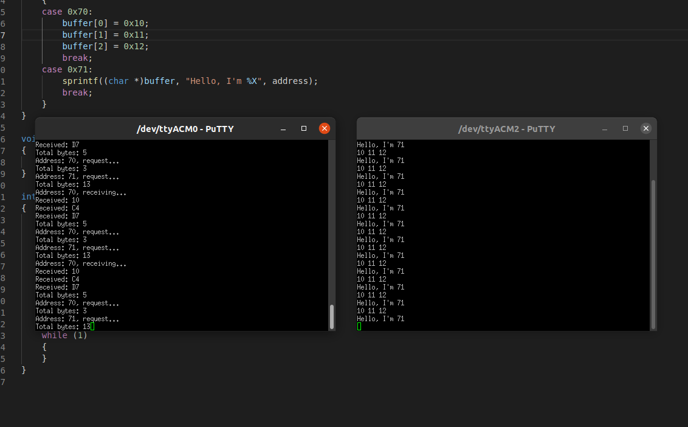

# I2C slave protocol for multiple addresses on RP2040

This library implements an I2C slave protocol for the RP2040 using PIO, with support for responding to multiple I2C addresses.

It is compatible with both the [Pico SDK](https://raspberrypi.github.io/pico-sdk-doxygen/) and [Arduino-Pico](https://github.com/earlephilhower/arduino-pico).

## Features

- I2C slave implemented in PIO
- Supports multiple I2C addresses
- Compatible with Pico SDK and Arduino-Pico
- Separate read and write buffers
- Optional request and stop handlers
- Supports fixed-length transfers for compatibility with buggy I2C masters
- Supports standard I2C speeds up to 1 MHz
- Uses one full PIO instance

## High-speed operation

The library has been tested beyond standard I2C speeds.

Operation at 2 MHz has been verified, but timing margins become very small, especially with back-to-back transactions and the stop callback enabled. Speeds above 1 MHz should therefore be considered experimental.

## Usage

### Pico SDK

Add the following files to your project:

- `i2c_multi.pio`
- `i2c_multi.h`
- `i2c_multi.c`

Then update your `CMakeLists.txt` to:

- call `pico_generate_pio_header`
- link the required libraries:
  - `pico_stdlib`
  - `hardware_irq`
  - `hardware_pio`
  - `hardware_i2c`

See [sdk/CMakeLists.txt](sdk/CMakeLists.txt) for an example.

### Arduino

Add the following files to your project:

- `i2c_multi.pio.h`
- `i2c_multi.h`
- `i2c_multi.c`

### Basic setup

- Define the request and stop handlers if needed
- Set the write buffer used for data sent by the slave
- Set the read buffer used for data received by the slave
- Enable the I2C addresses you want to use for communication

Example:

```c
uint8_t write_buffer[64];
uint8_t read_buffer[64];

i2c_multi_init(pio0, 0);

i2c_multi_set_write_buffer(write_buffer);
i2c_multi_set_read_buffer(read_buffer);

i2c_multi_set_request_handler(request_handler);
i2c_multi_set_stop_handler(stop_handler);

i2c_multi_enable_address(0x70);
i2c_multi_enable_address(0x71);
```

## Buffer operation

The library uses separate buffers for each transfer direction.

### Write buffer

The write buffer contains data that the slave sends to the master.

When the master starts a read transaction, the request handler is called before the first byte is transmitted. The application can use this callback to prepare the contents of the write buffer.

### Read buffer

The read buffer stores data received from the master.

Received bytes are written sequentially into the buffer. The I2C address byte is not stored in the buffer.

When the transaction ends, the stop handler can be used to determine the address, transfer direction, and number of bytes transferred.

Both buffer pointers are automatically reset to the beginning of their respective buffers at the end of each transaction.

## Hardware notes

**Use pull-up resistors from 1 kΩ to 3.3 kΩ.**

Use lower resistor values for higher bus speeds.

See [sdk/main.c](sdk/main.c) for a usage example.

<p align="center">
  <br>
  <i>RP2040 configured as an I2C slave (left), receiving and sending data through multiple I2C addresses from an I2C master (right)</i>
</p>

## API reference

### `void i2c_multi_init(PIO pio, uint pin)`

Must be called first.

**Parameters**

- `pio` - PIO instance where the program will be loaded (`pio0` or `pio1`)
- `pin` - SDA pin number; SCL is assigned to `pin + 1`

---

### `void i2c_multi_set_request_handler(i2c_multi_request_handler_t handler)`

Sets the request handler.

The handler is called when the master starts a read transaction.

**Parameters**

- `handler` - function called when the master requests data

---

### `void i2c_multi_set_stop_handler(i2c_multi_stop_handler_t handler)`

Sets the stop handler.

The handler is called when the current transaction ends.

**Parameters**

- `handler` - transaction completion callback

---

### `void i2c_multi_set_write_buffer(uint8_t *buffer)`

Sets the buffer used for data sent from the slave to the master.

**Parameters**

- `buffer` - write buffer

---

### `void i2c_multi_set_read_buffer(uint8_t *buffer)`

Sets the buffer used for data received from the master.

**Parameters**

- `buffer` - read buffer

---

### `void i2c_multi_disable(void)`

Puts I2C on hold by disabling the PIO state machines.

---

### `void i2c_multi_restart(void)`

Restarts the PIO state machines and resets the internal state.

---

### `void i2c_multi_remove(void)`

Removes the PIO state machines and clears handlers, buffers, and internal state.

---

### `void i2c_multi_enable_address(uint8_t address)`

Enables one I2C address.

**Parameters**

- `address` - I2C address to enable

---

### `void i2c_multi_disable_address(uint8_t address)`

Disables one I2C address.

**Parameters**

- `address` - I2C address to disable

---

### `void i2c_multi_enable_all_addresses(void)`

Enables all I2C addresses.

---

### `void i2c_multi_disable_all_addresses(void)`

Disables all I2C addresses.

---

### `bool i2c_multi_is_address_enabled(uint8_t address)`

Checks whether an I2C address is enabled.

**Parameters**

- `address` - I2C address to check

**Returns**

- `true` if the address is enabled
- `false` otherwise

---

### `void i2c_multi_fixed_length(int16_t length)`

Releases the bus after the specified number of bytes has been sent.

Useful for compatibility with buggy I2C masters.

## Handler callbacks

I2C callbacks run in interrupt context and should be kept short and non-blocking.

Avoid `printf`, `Serial`, delays, or other slow operations inside callbacks, particularly with back-to-back transactions.

### `void request_handler(uint8_t address)`

Called when the master starts a read transaction.

This callback can be used to prepare the write buffer before transmission begins.

**Parameters**

- `address` - I2C address used in the request

---

### `void stop_handler(uint8_t address, bool is_read, uint length)`

Called when the current I2C transaction ends.

**Parameters**

- `address` - I2C slave address used for the transaction
- `is_read` - `true` when the slave received data from the master, `false` when the slave sent data to the master
- `length` - number of data bytes received or sent, excluding the address byte

## Changelog

### [v2](https://github.com/dgatf/I2C-slave-multi-address-RP2040/releases/tag/v1.1.1)

- Replaced the per-byte receive callback with a read buffer
- Added separate read and write buffers
- Extended the stop callback to report the address, transfer direction, and number of bytes transferred

### [v1.1.1](https://github.com/dgatf/I2C-slave-multi-address-RP2040/releases/tag/v1.1.1)

- Updated examples and documentation to avoid blocking operations inside I2C callbacks; no functional changes to the core library.

### [v1.1](https://github.com/dgatf/I2C-slave-multi-address-RP2040/releases/tag/v1.1)

- Reduced from 32 to 28 PIO instructions
- Improved high-speed operation
- Added `i2c_multi_fixed_length()` to release the bus after a fixed number of bytes

### [v1.0](https://github.com/dgatf/I2C-slave-multi-address-RP2040/releases/tag/v1.0)

- Initial release